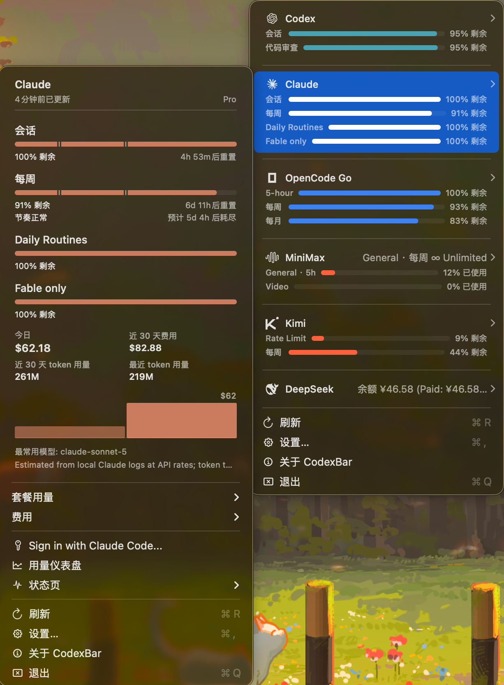
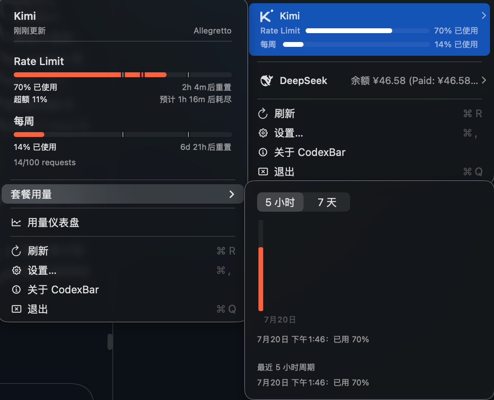

# CodexBar 🎚️ — May your tokens never run out.

> Every AI coding limit, in your menu bar.

[](LICENSE)



## 这是什么

CodexBar 是一个 macOS 菜单栏小工具，把 Codex、Claude、Cursor、Gemini、Copilot、MiniMax、Kimi、DeepSeek 等几十种 AI 编程/对话服务的用量额度、重置倒计时、费用统计都汇总到一个下拉菜单里，不用再一个个开网页查配额。

本仓库 fork 自 [steipete/CodexBar](https://github.com/steipete/CodexBar)（MIT 协议），感谢原作者 [Peter Steinberger](https://twitter.com/steipete) 的出色工作。原项目的完整功能列表和使用文档见上游仓库。

## 这份 fork 改了什么

在原项目基础上做了以下调整：

- **移除 Agent Sessions 功能** — 删除了本地/远程会话扫描、聚焦、CLI 命令及相关设置和文档，简化菜单和代码体积。
- **重构合并菜单的账号切换与总览子菜单** — 重写了多账号 Provider 切换器的实现（`StatusItemController+AccountSwitcherViews.swift`），替换了旧的 switcher 实现。
- **修复总览行悬浮子菜单闪烁问题** — 悬浮 Provider 详情子菜单时，因子菜单内容未重新打上身份标记，导致父行在子菜单打开时被重建，引发子菜单反复关闭又打开的抖动。
- **修复 Provider 仪表盘/状态页链接** — 让菜单里的 Dashboard、Status 跳转按 Provider 区分，跳到正确的目标页面。
- **增强 Kimi 用量面板** — 菜单显示会员计划名（如 Allegretto）和周配额请求数（used/limit）；新增「套餐用量」历史：记录每个 5 小时周期和每周（7 天）额度的消耗百分比，图表支持 5 小时｜7 天切换，下方列出最近 5 小时周期的峰值用量，与 Claude/Codex 的历史视图一致。
- 若干本地化字符串调整。

具体改动见 [CHANGELOG.md](CHANGELOG.md) 和 git 提交历史。

## 效果预览

上图为中文本地化界面下的 Claude、Codex、OpenCode Go、MiniMax、Kimi、DeepSeek 用量面板示例：每个 Provider 的会话/每周/每日额度、剩余百分比、重置倒计时和费用统计一目了然。

Kimi 的「套餐用量」子菜单：5 小时｜7 天切换查看历史额度曲线，下方列出最近 5 小时周期的峰值用量：



## Build from source

需要 macOS 14+ 和 Swift 6.2+。

```bash
./Scripts/package_app.sh        # builds CodexBar.app in-place with ad-hoc signing
open CodexBar.app
```

Dev loop:
```bash
./Scripts/compile_and_run.sh
./Scripts/compile_and_run.sh --test  # also run the sharded test suite before packaging/relaunching
make check                           # SwiftFormat + SwiftLint
```

CLI 安装（需先把 CodexBar.app 装到 /Applications）：
```bash
./bin/install-codexbar-cli.sh
```

更多开发文档：[docs/DEVELOPMENT.md](docs/DEVELOPMENT.md)、[docs/architecture.md](docs/architecture.md)。

## Credits

- 原项目：[CodexBar](https://github.com/steipete/CodexBar) by Peter Steinberger（MIT）
- 本 fork 的代码修改由 **Kimi Code + Kimi K2.7 Coding** 与 **Claude Code + Claude Sonnet 5** 共同协作完成。

## License

MIT，见 [LICENSE](LICENSE)。版权归原作者 Peter Steinberger 所有；本 fork 中的修改部分同样以 MIT 协议开源。
